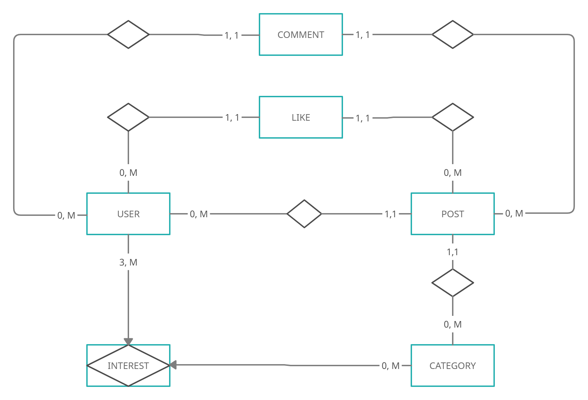

# BStorm  

User manual for installing and starting the application

## Installing project

### Prerequisites:

- Installed [GIT CLI](https://git-scm.com/)
- Installed [Composer](https://getcomposer.org/download/)  
- Installed [Docker](https://www.docker.com/products/docker-desktop)

---

We are going to clone repo with command

```bash
git clone https://github.com/GaGiiiii/BStr/
```

We then open terminal, and then type:

```bash
cd BStr
composer i
```

with the commands above we have installed all the dependencies located in the composer.json file

---

## Starting project

### Starting backend

We are going to start backend from "BStr" directory with command:

```bash
docker compose up
```

This command will start docker container meant for development.    
  
In the container server is started using "php artisan serve" command   
Application is listening for any changes in code and after every chnage app will restart automatically.

Backend works on [localhost:8000](http://localhost:8000/)   

## Starting Tests

For tests to execute we need to enter next command inside our root directory of out project

```bash
php artisan test
```

## Documentation

### Below is the ER Model



### Relation Model:  

---  
User(**id**, first_name, last_name, image, email, email_verified_at, password, remember_token, created_at, updated_at)  
Category(**id**, name, created_at, updated_at)  
Post(**id**, *user_id*, *category_id*, title, body, created_at, updated_at)  
Like(**id**, ***post_id, user_id***, created_at, updated_at)  
Comment(**id**, ***post_id, user_id***, body, created_at, updated_at)  
Interest(**id**, ***user_id, category_id***, created_at, updated_at)

---

## API Documentation

#### Get all items

```http
GET /api/posts
```

| Parameter | Type     | Description                |
| :-------- | :------- | :------------------------- |
| `sortBy` | `string` | Available options **dateDesc \| dateAsc \| popularity** |
| `categories` | `string` | In format: **1,3,5** where 1,3,5 are **id's** of categories |
| `search` | `string` | First name / Last name of user who created post |

#### Get item

```http
GET /api/items/${id}
```

| Parameter | Type     | Description                       |
| :-------- | :------- | :-------------------------------- |
| `id`      | `string` | **Required**. Id of item to fetch |

## Responses

API returns a JSON response in the following format:

```javascript
{
  "message": string,
  "data": data,
  "errors?": array (in cases of errors)
}
```
The `message` - attribute contains a message commonly used to indicate errors or, in the case of deleting a resource, success that the resource was properly deleted.

The `data` - attribute contains requested resource/s or processed resource. Eg. if we requsted to get all posts the data attr will look like this `"posts": array of posts`  

The `errors` - attribute is optional and it contains error messages

## Status Codes

API returns the following status codes:

| Status Code | Description |
| :--- | :--- |
| 200 | `OK` |
| 201 | `CREATED` |
| 400 | `BAD REQUEST` |
| 404 | `NOT FOUND` |
| 500 | `INTERNAL SERVER ERROR` |


